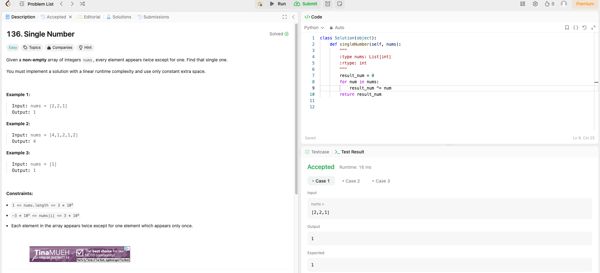

# Weekly Update 4 6/10/24

## What happened last week?
I worked on the LinkedIn Learning course and completed two mini courses (they were both longer courses, hence the two instead of three courses). Additionally, I completed one Leetcode problem that is attached in the github website. I also turned in my project proposal.

## What do I plan to do this week?
I plan to complete two to three more mini courses (they are longer hours again this week) and another Leetcode problem. 

## Are there any temporary roadblocks?
The courses this week (like last week) are a little longer, thus I may only be able to complete two courses instead of the usual three for this week. I have another class whose homeworks looks like it might take awhile this week, so that could cause me to get started a day later when it comes to the LinkedIN courses.

## How can I make the process work better?
Keeping strict boundaries on my time will help to get the work done on schedule. Moving the Leetcode problem to earlier in the week helped last week with time management, so I plan on doing that again. I will consider extending the course time frame for finishing it to be much later and then start to work in on it in conjunction with the website, might be the best plan.

## Leetcode 40 minutes 

