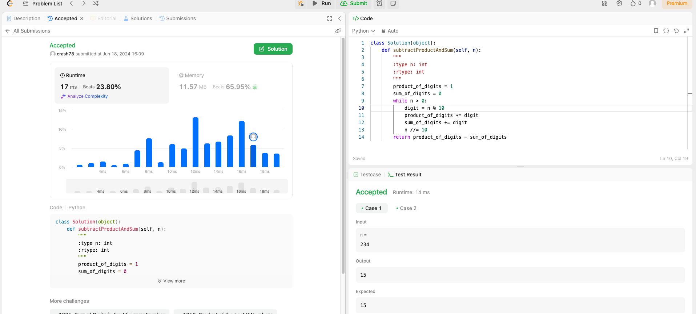

# Weekly Update 5 6/17/24

## What happened last week?
I worked on the LinkedIn Learning course and completed two mini-courses. One was on CSS and the other on SQL basics (they were both longer mini-courses, hence the two instead of three courses). Additionally, I completed one Leetcode problem that is attached in the github website. I also fine-tuned my website to make it presentable to viewers.

## What do I plan to do this week?
I plan to complete two more mini-courses and another Leetcode problem. The mini-courses are more mentally taxing than I anticipated, thus I have lowered my weekly course goal to two mini-courses instead of three. I also plan to start sketching out my plan for the final project website. If I have extra time, I will begin to think about the code layout in HTML.

## Are there any temporary roadblocks?
The courses this week are a little longer, thus I only am able to complete two courses instead of the usual three for this week. This has caused my timeline to lengthen to complete the courses in 8 weeks instead of 6. However, I feel like I have a good foundation in HTML and CSS so I can start building time into my weekly schedule that was previously taken up by courses to begin planning and laying out the website project.

## How can I make the process work better?
Letting go of strict expectations surrounding completing three courses a week and dialing it back to two makes the courses more managable. Moving the Leetcode problem to earlier in the week also helps with time management, so I plan on continuing that as well. I will consider an updated planning timeframe for starting the website project and make sure that moves ahead on schedule, with a little extra planning from time freed up from working on the mini-courses.

## Leetcode 38 minutes 

