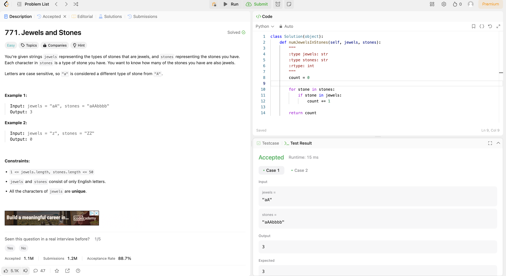

# Weekly Update 6 6/24/24

## What happened last week?
I worked on the LinkedIn Learning course and completed three mini-courses. One was on Java 11 and the others were on Python topics. Additionally, I completed one Leetcode problem that is attached in the github website. I also made a rough plan for my website that includes the amount of races I want on the site per state, the states they are in, how they are organized (alphabetically), and the presence of a search bar.

## What do I plan to do this week?
I plan to finish up the LinkedIn Learning course by completing the last two mini-courses and another Leetcode problem. I also plan to sketch out the code for the website with HTML (and if I have time CSS styling).

## Are there any temporary roadblocks?
No, I am actually back on track with finishing my course by the end of week 6/7 so I feel good about starting on the project and completing it within the rest of the timeframe allotted for the semester. 

## How can I make the process work better?
Keeping the Leetcode problem earlier in the week continues to help with time management. I do not need an updated timeline for finishing the LinkedIn Learning course and starting the project as I am roughly on schedule. Once this week is over, I will turn my focus fully to the website project. 

## Leetcode 28 minutes 

