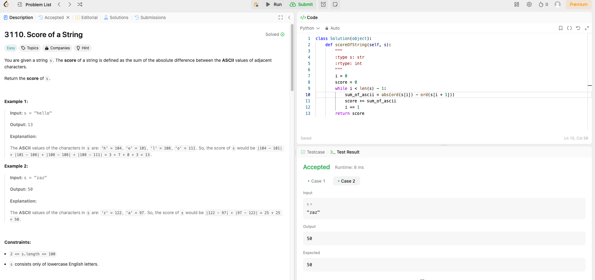

# Weekly Update 3 6/3/24

## What happened last week?
I worked on the LinkedIn Learning course and completed three mini courses. Additionally, I completed one Leetcode problem that is attached in the github website. I also turned in my project proposal.

## What do I plan to do this week?
I plan to complete two-three more mini courses (they are longer hours this week) and another Leetcode problem. 

## Are there any temporary roadblocks?
The courses this week are a little longer, thus I may only be able to complete two courses instead of the usual three for this week. I have another class with an exam, so that may eat into 
some extra time I have set aside for projects in this class.

## How can I make the process work better?
Keeping strict boundaries on my time will help to get the work done on or very nearly on schedule. Moving the Leetcode problem to earlier in the week might help with time management.

## Leetcode 1 hour

