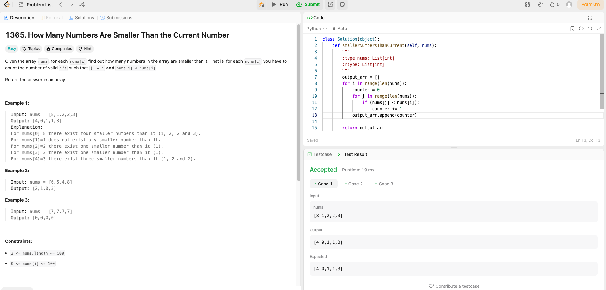

# Weekly Update 7 7/1/24

## What happened last week?
I worked on the LinkedIn Learning course and completed the last two mini-courses. One was on Javascript and the other was on C#. Additionally, I completed one Leetcode problem that is attached below. I also sketched out some basic HTML coding for the website (on paper). It's very rudimentary but I look forward to tweaking it and adding CSS to help make it into an actual website!

## What do I plan to do this week?
I plan to do another Leetcode problem. I also plan to input the code that I sketched out for the website with HTML and begin adding CSS elements.

## Are there any temporary roadblocks?
I have some other pressing work in a class that is taking longer than expected, so that may cut into some extra time I built in for working on the code. 

## How can I make the process work better?
Keeping the Leetcode problem earlier in the week continues to help with time management. Alternating days working on the other class I am in and this one may help me make sure I keep on top of items for each class. Making sure to have 50 to 75% of the work for the week done before the weekend will help keep me on track as well.

## Leetcode 30 minutes 

