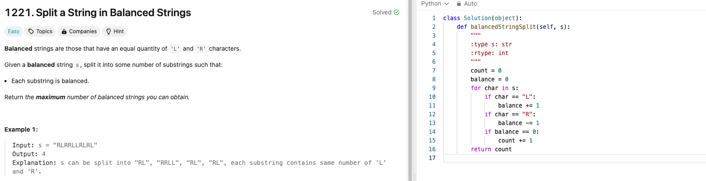
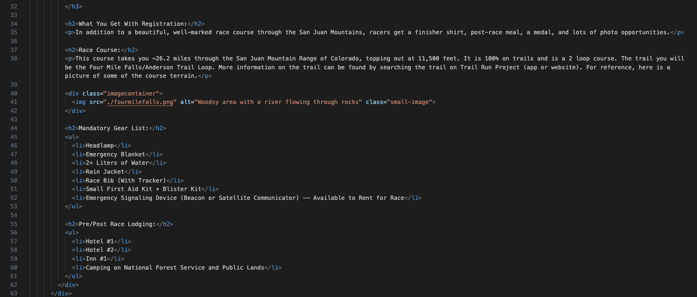

# Weekly Update 10 7/22/24

## What happened last week?
I worked on the website and have the homepage done with the new layout that directs to the race information page. The one problem with the page is the footer needs some work as it changed positions unintentionally due to other CSS elements when working on the second page for the website. I began working on the second page to the website, the race information page. Additionally, I completed one Leetcode problem that is attached below.

## What do I plan to do this week?

I plan to do another Leetcode problem. I also plan to fix the footer on the landing page and finish up the information page for the race website. 

## Are there any temporary roadblocks?

The footer issue with the landing page is proving to be challenging due to when I change the code, it impacts other areas of the site. 

## How can I make the process work better?
Figuring out a solution for the footer issue may require some out of the box thinking, but if I ponder the problem over a couple of days, I think I will come up with some sort of solution.

## Leetcode 25 minutes 

## Project Code Update: Part of Race Information Page HTML

