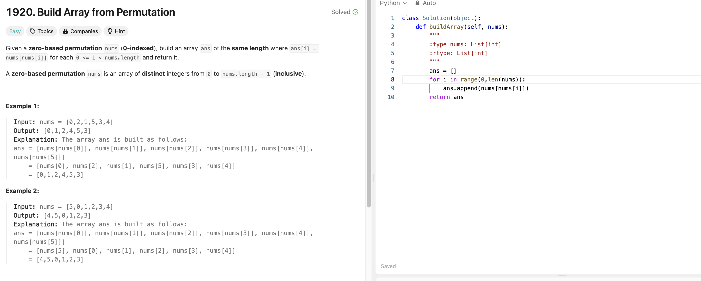
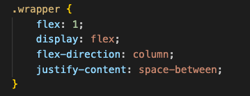

# Weekly Update 11 7/29/24

## What happened last week?
I worked on the website and have the homepage footer done (finally!) after the CSS issue last week. I also worked on the second page to the website, the race information page. Additionally, I completed one Leetcode problem that is attached below.

## What do I plan to do this week?

I plan to do another Leetcode problem. I also plan to finish up the information page for the race website with some last minute tweaking of the CSS. 

## Are there any temporary roadblocks?

The footer was difficult to fix, but I moved past it! 

## How can I make the process work better?
Wrapping up the project and reflecting on what I have learned in preparation for the final report might be helpful.

## Leetcode 33 minutes 

## Project Code Update: Magic Section of CSS to Fix Footer

