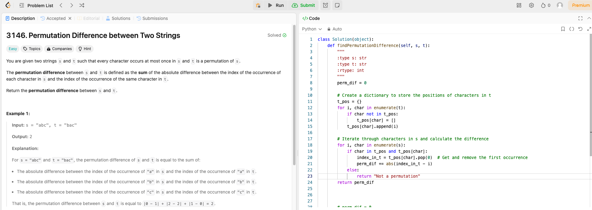
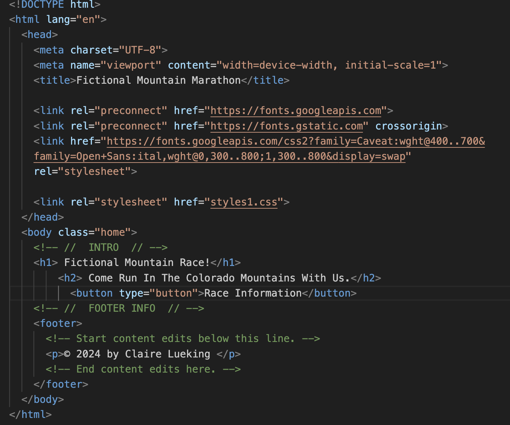

# Weekly Update 8 7/8/24

## What happened last week?
I worked on the website and almost have the homepage done with the search bar. It just needs a little more TLC with some CSS. Additionally, I completed one Leetcode problem that is attached below. I also worked on the project update report. 

## What do I plan to do this week?

I plan to do another Leetcode problem. I also plan to pivot my project to make a landing page and potentially an information page for a (fictional) race website. My struggles with the search bar plus the research I have done, make it sound not feasible in the time I have left in the semester to make a few webpages with dynamic results. 

## Are there any temporary roadblocks?

I am struggling a little more than anticipated with some CSS elements for the homepage, but I plan to set aside extra time to read up on ways to debug and test those ideas out to help me fix the issues. Due to some extra research, I have decided to scrap the project and focus on a simpler website design as mentioned above. Keeping on target for the website build may prove to be challenging, but I can help improve this by simplifying parts of my website.

## How can I make the process work better?
Alternating days working on the other class I am in and this one helps me make sure I keep on top of items for each class. I'm not always able to keep on a perfect schedule, but aiming for this goal helps!

## Leetcode 22 minutes 

## Project Code Update: Homepage HTML

