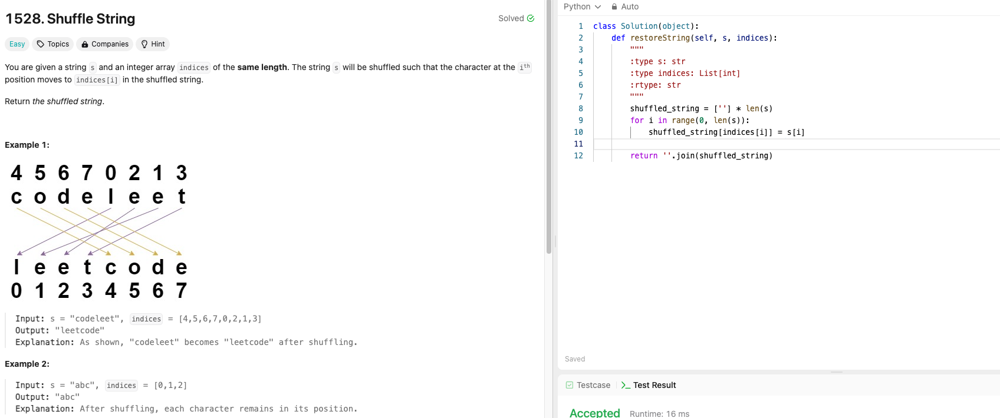

# Weekly Update 12 8/5/24

## What happened last week?
I worked on the website and have the two pages completely finished. Additionally, I completed one Leetcode problem that is attached below.

## What do I plan to do this week?
I plan to do another Leetcode problem and will continue to do some into the next semester. The project is done for this class. I just need to put finishing touches on the Final Report.

## Are there any temporary roadblocks?
No.

## How can I make the process work better?
Continuing to keep up with current HTML and CSS trends as well as working on the coding problems will help me with future classes and when looking to get a job.

## Leetcode 15 minutes 

## Project Code Update: Links to Completed Pages
[Homepage Code](./code/index1.html) * |
[Race Info Page Code](./code/raceinfo.html) *

* To open the pages, download the files and double click in your Downloads folder

